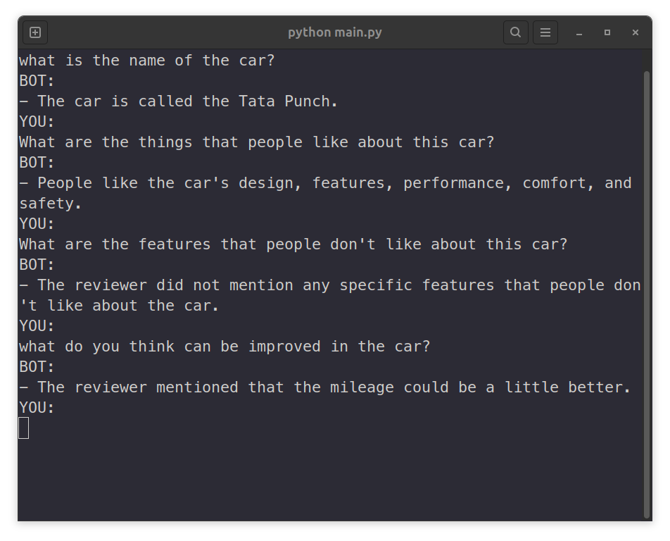

# Car Improvement Review Assistant (CIRA)

This project implements a Retrieval-Augmented Generation (RAG) model designed to assist with car improvement analysis based on user reviews. The model processes user input, retrieves relevant information from a pre-processed text file, and generates detailed responses using a fine-tuned language model.



## Features

- **Semantic Search:** Utilizes a vector database to perform Maximum Marginal Relevance (MMR) search, retrieving the most relevant segments from the reviews.
- **Quantized Model:** Leverages a quantized language model to optimize memory usage and inference speed.
- **Spinning Loader:** Provides a visual indicator during processing.
- **Custom Embedding Model:** Employs a Sentence Transformer model to generate document and query embeddings.

## Requirements

- Python 3.7+
- PyTorch
- Hugging Face Transformers
- Sentence Transformers
- Langchain
- Chroma

## Installation

1. **Clone the repository:**

    ```bash
    git clone https://github.com/majipa007/product_review_rag.git
    cd product_review_rag
    ```

2. **Install the required packages:**

    ```bash
    pip install torch transformers sentence-transformers langchain chromadb
    ```

3. **Prepare the environment:**

   Ensure you have a compatible GPU for model inference. The model is configured to run on a CUDA device with 4-bit quantization.

## Usage

1. **Prepare your document:**

   Place your text file containing car reviews in the root directory and rename it to `output.txt`. The reviews should be separated by a line of dashes (`--------------------------------------------------`).

2. **Run the assistant:**

    Execute the following command to start the assistant:

    ```bash
    python <script_name>.py
    ```

3. **Interact with the assistant:**

    - Type your queries in the console.
    - The assistant will retrieve relevant reviews and generate a response.
    - Type `bye` to exit the conversation.

## Code Overview

- **`SentenceTransformerEmbeddings` Class:**
  - **`embed_documents`:** Generates embeddings for multiple documents.
  - **`embed_query`:** Generates an embedding for a single query.

- **`RAG` Class:**
  - **`__init__`:** Initializes the model, tokenizer, and vector database. Configures the model with 4-bit quantization for efficient memory usage.
  - **`spinning_loader`:** Displays a spinning loader during processing.
  - **`document_loader`:** Loads and splits the text file into separate review documents for vector database insertion.
  - **`vector_database`:** Creates a Chroma vector database from the review documents.
  - **`retrieving`:** Performs a similarity search in the vector database based on user queries.
  - **`semantic_search`:** Performs a Maximum Marginal Relevance search to retrieve the most relevant document segments.
  - **`run`:** The main loop for interacting with the assistant.

## Customization

- **Model:** Change the model used for text generation by updating the `model` and `tokenizer` paths in the `__init__` method.
- **Review Document:** Replace `output.txt` with your own text file for custom retrievals.
- **Generation Arguments:** Modify `generation_args` in the `__init__` method to change the behavior of text generation (e.g., `max_new_tokens`, `temperature`).

## Contributing

Feel free to fork this repository, submit pull requests, or open issues if you find bugs or have suggestions for improvements.